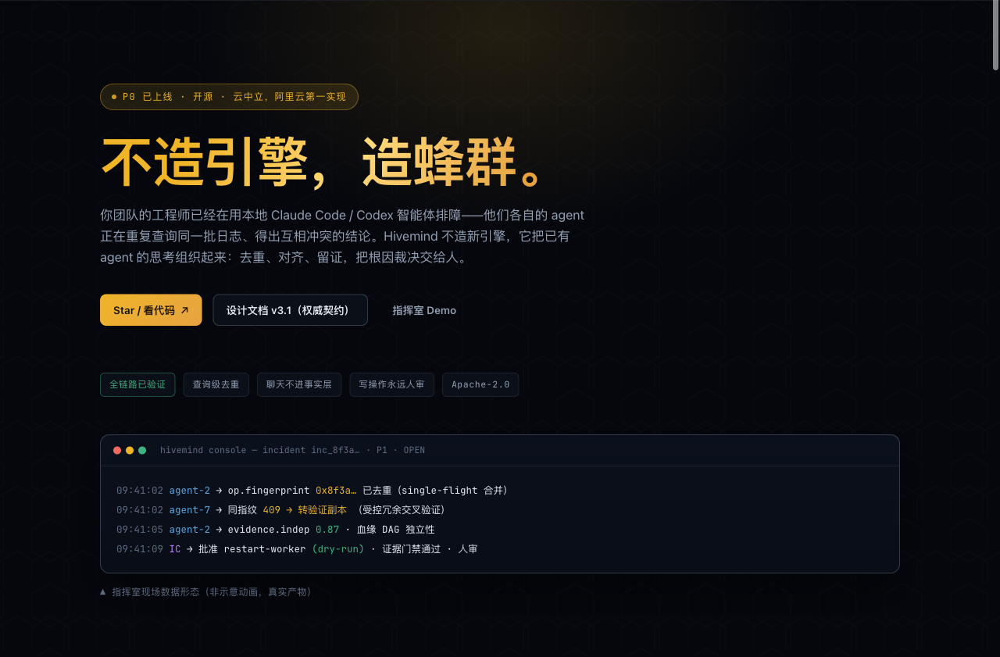

# Hivemind（运维蜂巢）

<p align="center">
  <a href="https://samson-samson.github.io/hivemind/design/hivemind-promo.html">
    
  </a>
</p>

<p align="center">
  <a href="https://samson-samson.github.io/hivemind/design/hivemind-promo.html"><strong>Promo (中/EN)</strong></a> ·
  <a href="docs/superpowers/specs/2026-08-12-hivemind-design.md"><strong>Design doc v3.1</strong></a> ·
  <a href="https://github.com/samson-samson/hivemind"><strong>GitHub</strong></a>
</p>

> **Don't build another agent. Build the hive.** / 不造引擎，造蜂群。

It's 3am. Five engineers are paging through the same pod. Each re-runs the same
`kubectl logs`, because nobody sees that the person next to them already did.
That's the problem Hivemind actually solves — not "agents aren't smart enough,"
but that the agents on your team have no substrate for shared thinking.

Every engineer's desk already runs a local Claude Code or Codex. Hivemind doesn't
replace them. It bolts on the one layer they're missing: a shared fact base where
evidence lives longer than a terminal session, duplicate reads get coalesced, and
no write happens without a human clicking confirm.

**是不是又一个 AIOps 平台？** Not really. Most AIOps tries to build a smarter
agent that ingests everything and tells you the root cause. We learned the hard
way that's a dead end — see [§1.2 of the design doc](docs/superpowers/specs/2026-08-12-hivemind-design.md).
The value isn't in a cleverer engine, it's in coordination and in knowledge that
survives the incident. So we don't build an agent. We build the coordination
around the ones that already exist.

## Why it exists

The thing that actually wastes money on an incident isn't a wrong hypothesis — it's
five people independently paying the same token cost for the same query, and the
right evidence getting lost when someone's `tmux` dies. The four lines below are
the four ways we stop that from happening. None of them are novel; all of them are
usually missing.

- **Evidence before chat.** A war room can argue forever; the fact layer can't.
  Structured evidence gets a slot, chat doesn't. Whether a root cause is *true*
  is still called by a human — we just make sure the evidence is still there when
  they call it.
- **Query-level dedupe.** One read benefits the whole team. We single-flight on an
  operation fingerprint, not distributed-lock the work — because a redundant read
  is cheap and a dropped hypothesis isn't. Coordination is "minimize accidental
  duplication + cross-validate with controlled redundancy," never "zero duplication."
- **Knowledge distillation, two phases.** "It happened before" ≠ "it's reusable."
  During the incident we only emit candidates; after, a review chain certifies them
  (`candidate → reviewed → validated → certified → revoked`). The LLM proposes;
  compile/policy/tests decide what ships.
- **Writes are always human-gated.** No write path without a threat model — P0 ships
  with none. AI locates, a human decides, a machine acts only with evidence attached.

## What we refused to build

No agent engine (we reuse local Claude Code/Codex via a thin MCP adapter). No
"fully autonomous expert team" — agents default to IC + PMA + evidence gating. No
LLM-published knowledge — candidates must clear the certification chain.

It's worth saying the quiet part out loud: a lot of these decisions are reactive.
We shipped a thing called aievo once that did build the engine. It was the wrong
shape. The four lines above are what was left after removing the parts that didn't
earn their keep.

## What actually runs

We tested it end-to-end on real Alibaba Cloud SLS alerts. A genuine alarm fires → a
dedicated war room opens → the headless diagnoser reads real logs → GLM-5.2 produces
structured hypotheses → the IC decides → a runbook is distilled and certified → a
similar incident later recalls in seconds (token-level Jaccard) → any recovery action
hits an evidence gate + dry-run. Three closed loops, all run locally, zero production
side effects.

Cloud-agnostic with Alibaba Cloud as the first implementation (SLS / ARMS / ACK /
ChaosBlade). Open source under Apache-2.0 — a project plus a reference implementation,
not a product pitch.

> Dev conventions and model routing live in `CLAUDE.md`.

## Repo layout

```
control-plane/    Go control plane: incident object model, work graph, query coordination, evidence bus, guardrails, security
distiller/        Python: candidate distillation, certification chain, knowledge graph
adapter/          MCP "spokesperson" adapter + per-agent onboarding examples
headless-agent/   the headless investigator (the digital worker)
console/          React/TS incident command UI
packs/            prebuilt environment packs: aliyun · k8s · prometheus · aws · azure · sls
adapter-protocol/ capability descriptor (gRPC + OpenAPI)
adapter-sdk/      connector plugin SDK
adapter-generator/ descriptor → connector generator
conformance/      connector acceptance suite
infra/            Terraform (Alibaba Cloud) + Helm
docs/             design doc + implementation briefs
```

## Roadmap

We're on P0. It's deliberately a read-only coordination ledger — work graph +
query dedupe + evidence lineage + a human IC + a v1 command room. No write path,
because none of this earns one yet. P1 → retrieval/evals, P2 → candidate
generation, P3 → typed reversible actions (single K8s target), P4 → ecosystem.
We don't ship a phase until the previous one has run on real incidents.
